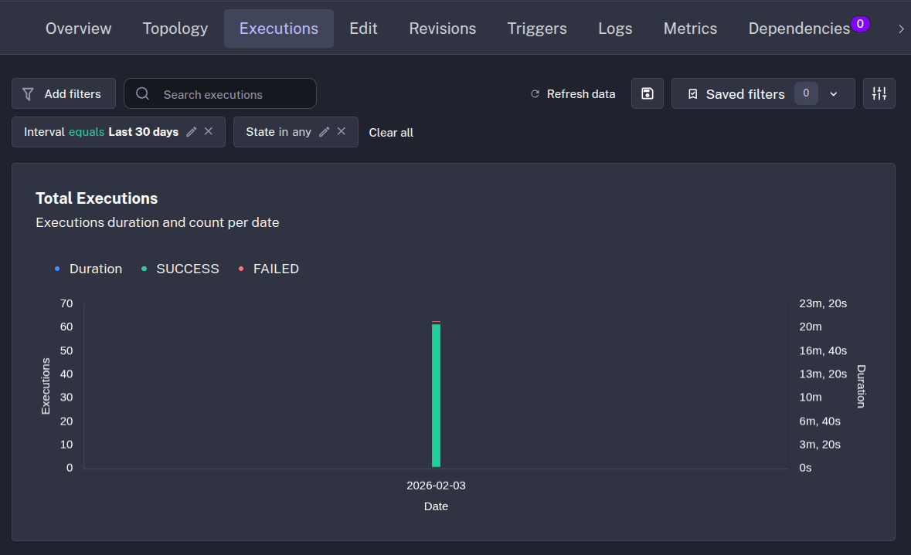
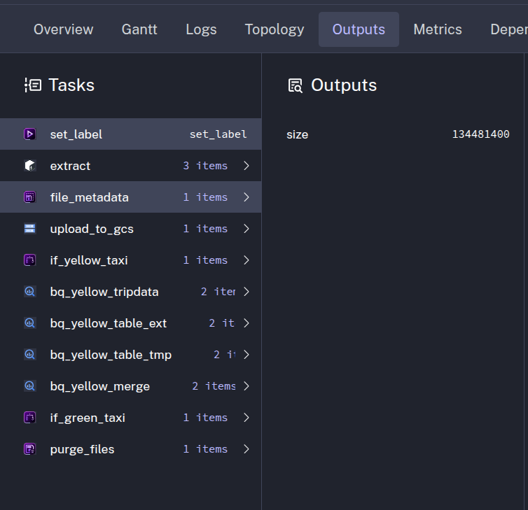

# Module 2 Assignment Answers

Link to the [homework](https://github.com/DataTalksClub/data-engineering-zoomcamp/blob/main/cohorts/2026/02-workflow-orchestration/homework.md) 
## Data Processing
All data of 2021 correctly backfilled into gcp storage and BigQuery Tables.

---

## Yellow Taxi 2020-12 File Size
**Answer:** 128.3 MiB

**Explanation:**
Go to executions, find the execution labeled "file:yellow_tripdata_2020-12.csv", click the execution "id" and navigate into outputs. But surprisingly under the outputs of extract task I didn't find the csv file size. 
After reviewing the flow, the reason is the task "purge_files" that remove the downloaded csv to avoid cluttering the storage.
To solve this, I added a new task "file_metadata" right after the "extract" task, the output of this new task is the name and size of the file downloaded during the previous "extract" task.
```yaml

  - id: file_metadata
    type: io.kestra.plugin.core.storage.Size
    uri: "{{ outputs.extract.outputFiles.values() | first }}"

```


## Rendered Variable Value
**Answer:** green_tripdata_2020-04.csv

## Yellow Taxi Rows (Year 2020)
**Answer:** 24,648,499

```SQL

SELECT
  COUNT(*)
FROM
  `ny-taxi-rides-485210.zoomcamp.yellow_tripdata`
WHERE
  EXTRACT(YEAR FROM tpep_pickup_datetime) = 2020;

```

## Green Taxi Rows (Year 2020)
**Answer:** 1,734,051

```SQL

SELECT
  COUNT(*)
FROM
  `ny-taxi-rides-485210.zoomcamp.green_tripdata`
WHERE
  EXTRACT(YEAR FROM lpep_pickup_datetime) = 2020;

```

## Yellow Taxi Rows (March 2021)
**Answer:** 1,925,152

```SQL

SELECT
  COUNT(*)
FROM
  `ny-taxi-rides-485210.zoomcamp.yellow_tripdata`
WHERE
  EXTRACT(YEAR FROM tpep_pickup_datetime) = 2021
  AND EXTRACT(MONTH FROM tpep_pickup_datetime) = 3;

```

## Schedule Trigger Configuration
**Answer:** Add a timezone property set to America/New_York in the Schedule trigger configuration

**Explanation:**
According to official documentation of kestra, timezone property is used in the schedule trtigger, the values are listed in the ["TZ identifier" of Wikipedia](https://en.wikipedia.org/wiki/List_of_tz_database_time_zones)